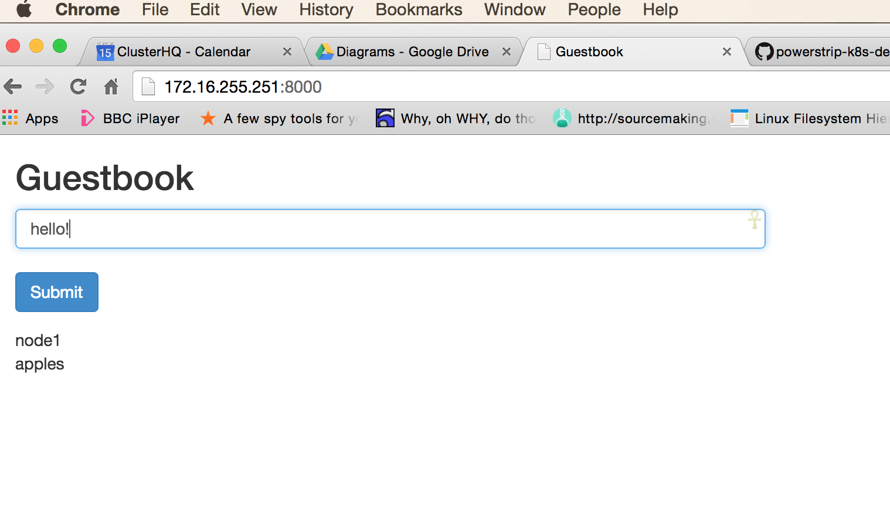

## Powerstrip-k8s-demo


**Please note:** *because this demo uses Powerstrip, which is only meant for prototyping Docker extensions, we do not recommend this configuration for anything approaching production usage. When Docker extensions become official, Flocker will support them. Until then, this is just a proof-of-concept.*


We [recently showed](https://clusterhq.com/blog/migration-database-container-docker-swarm/) how you could use [Docker Swarm](https://github.com/docker/swarm) to migrate a database container and its volume between hosts using only the native [Docker Swarm](https://github.com/docker/swarm) CLI. Today we are going to show you how to do the same thing using only [Kubernetes](https://github.com/googlecloudplatform/kubernetes).

[Kubernetes](https://github.com/googlecloudplatform/kubernetes) is great at orchestrating containers and [Flocker](https://github.com/clusterhq/flocker) is great at managing data volumes attached to containers.

Ideally - we want to use both systems together so we can orchestrate AND migrate containers.  That is the aim of this demo, to show how using [Powerstrip](https://github.com/clusterhq/powerstrip), we can extend Docker with tools like [Flocker](https://github.com/clusterhq/flocker) and still use orchestration tools like [Kubernetes](https://github.com/googlecloudplatform/kubernetes).

## Install

First you need to install:

 * [Virtualbox](https://www.virtualbox.org/wiki/Downloads)
 * [Vagrant](http://www.vagrantup.com/downloads.html)

*We’ll use [Virtualbox](https://www.virtualbox.org/wiki/Downloads) to supply the virtual machines that our [Kubernetes](https://github.com/googlecloudplatform/kubernetes) cluster will run on.*

*We’ll use [Vagrant](http://www.vagrantup.com/downloads.html) to simulate our application stack locally. You could also run this demo on AWS or Rackspace with minimal modifications.*

## Start VMSs

To run the demo:

```bash
$ git clone https://github.com/binocarlos/powerstrip-k8s-demo
$ cd powerstrip-k8s-demo
$ vagrant up
```

## Scenario

This demo is the classic kubernetes `guestbook` app that uses PHP and Redis.

The aim is to migrate the Redis container AND it's data using nothing other than Kubernetes primitives.

We have labeled the 2 minions `spinning` and `ssd` to represent the types of disk they have.  The Redis server is first allocated onto the node with the spinning disk and then migrated (along with its data) onto the node with an ssd drive.

This represents a real world migration where we realise that our database server needs a faster disk.

#### Before migration

###### *fig 1. multiple PHP containers accessing Redis container on node 1*

#### After migration

###### fig 2. Redis container & data volume migrated to node 2

## Demo

We have 1 `pod` for the Redis server and a `replication controller` for the PHP containers.

The first step is to SSH into the master node.

```bash
$ vagrant ssh master
```

We can now use the `kubectl` command to analyze our Kubernetes cluster:

```bash
master$ kubectl get nodes
NAME                LABELS              STATUS
democluster-node1   disktype=spinning   Ready
democluster-node2   disktype=ssd        Ready
```

Notice how we have labelled node1 with `disktype=spinning` and node2 with `disktype=ssd`.  We will use these labels together with a `nodeSelector` for the Redis Master pod.  The `nodeSelector` is what decides which node the redis container is scheduled onto.

We can also use `kubectl` to list the pods on the cluster:

```bash
master$ kubectl get pods
POD                 IP                  CONTAINER(S)        IMAGE(S)            HOST                LABELS              STATUS              CREATED
```

### Step 1: Start services
The first step is to spin up the 2 services.  Services are Kubernetes way of dynamically routing around the cluster - you can read more about services [here](https://github.com/GoogleCloudPlatform/kubernetes/blob/master/docs/services.md).

```bash
master$ kubectl create -f /vagrant/examples/guestbook/redis-master-service.json
master$ kubectl create -f /vagrant/examples/guestbook/frontend-service.json
```

We can check that those services were registered:

```bash
master$ kubectl get services
```

### Step 2: Start redis master
The next step is to start the redis master pod - we use the `redis-master-pod-spinning.json` file which has a nodeSelector set to `disktype=spinning`.

```bash
master$ kubectl create -f /vagrant/examples/guestbook/redis-master-controller.json
```

Once we have done this we run `kubectl get pods` and wait for the redis-master to move from status `Pending` to status `Running`

### Step 3: Start PHP replication controller
Now we start the PHP replication controller - this will start 3 PHP containers which all link to the redis-master service:

```bash
master$ kubectl create -f /vagrant/examples/guestbook/frontend-controller.json
```

Again - once we have run this - we run `kubectl get pods` and wait for our PHP pods to be in the `Running` state.

### Step 4: Confirm location of redis-master

Notice how the redis-master has been allocated onto node1 (`democluster-node1`):

```bash
master$ kubectl get pods | grep name=redis-master
redis-master-pod            10.2.2.8            redis-master        dockerfile/redis                          democluster-node1/172.16.255.251   app=redis,name=redis-master                    Running             About an hour
```

### Step 5: Access application

The next step is to load the app in your browser using the following address:

```
http://172.16.255.251:8000
```

This will load the guestbook application - make a couple of entries clicking `Submit` after each entry.


###### fig 3. screenshot of the guestbook app

### Step 6: Migrate database
Now it's time to tell kubernetes to move the Redis container and its data to node2 (the one with an SSD drive).

To do this we change the `nodeSelector` for the pod template (from spinning to ssd):

```bash
master$ kubectl get rc redis-master -o yaml | sed 's/spinning/ssd/' | kubectl update -f -
```

Then - we delete the redis-master pod.  The replication controller will spin up another redis-master but use the modified nodeSelector which means it will end up on node2 (with the ssd drive).

```bash
master$ kubectl delete pod -l name=redis-master
```

Once we have done this we run `kubectl get pods` and wait for the redis-master to move from status `Pending` to status `Running`.

Notice how the redis-master has been allocated onto node2 (`democluster-node2`):

```bash
master$ kubectl get pods | grep name=redis-master
redis-master-pod            10.2.3.9            redis-master        dockerfile/redis                          democluster-node2/172.16.255.252   app=redis,name=redis-master                    Running             About an hour
```

### Step 7: Access application

Now, load the app in your browser using same address:

```
http://172.16.255.251:8000
```

It should have loaded the entries you made originally - this means that Flocker has migrated the data onto another server!

note: it sometimes take 10 seconds for the service layer to connect the PHP to the Redis - if the data does not appear wait 10 seconds and then refresh

## How it works

The key part of this demonstration is the usage of [Flocker](https://github.com/clusterhq/flocker) to migrate data from one server to another. To make [Flocker](https://github.com/clusterhq/flocker) work natively with Kubernetes, we've used [Powerstrip](https://github.com/clusterhq/powerstrip). [Powerstrip](https://github.com/clusterhq/powerstrip) is an open-source project we started to prototype Docker extensions. 

This demo uses the [Flocker](https://github.com/clusterhq/flocker) extension prototype ([powerstrip-flocker](https://github.com/clusterhq/powerstrip-flocker)). Once the official Docker extensions mechamisn is released, [Powerstrip](https://github.com/clusterhq/powerstrip) will go away and you’ll be able to use Flocker directly with Kubernetes (or Docker Swarm, or Apache Mesos) to perform database migrations.

We have installed [Powerstrip](https://github.com/clusterhq/powerstrip) and [powerstrip-flocker](https://github.com/clusterhq/powerstrip-flocker) on each host.  This means that when Kubernetes starts a container with volumes - [powerstrip-flocker](https://github.com/clusterhq/powerstrip-flocker) is able prepare / migrate the required data volumes before docker starts the container.

### Kubernetes Cluster
The 2 nodes are joined by the Kubernetes `master`.  This runs the various other parts of Kubernetes (`kube-controller`, `kube-scheduler`, `kube-apiserver`, `etc`).  It also runs the `flocker-control-service`.


###### fig 4. overview of the Kubernetes cluster

## Conclusion
Kubernetes is a powerful orchestration tool and we have shown that you can extend it's default behaviour using [Powerstrip](https://github.com/clusterhq/powerstrip) adapters (and soon official Docker extensions).

This demo made use of local storage for your data volumes. Local storage is fast and cheap and with [Flocker](https://github.com/clusterhq/flocker), it’s also portable between servers and even clouds. 

We are also working on adding support for block storage so you can use that with your application.

## Notes

#### Restart cluster

If you `vagrant halt` the cluster - you will need to restart the cluster using this command:

```bash
$ make boot
```

This will `vagrant up` and then run `sudo bash /vagrant/install.sh boot` which spins up all the required services.


#### /vagrant/demo.sh

There is a script that can automate the steps of the demo:

```bash
$ vagrant ssh master
master$ sudo bash /vagrant/demo.sh up
master$ sudo bash /vagrant/demo.sh switch
master$ sudo bash /vagrant/demo.sh down
```