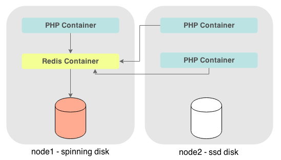
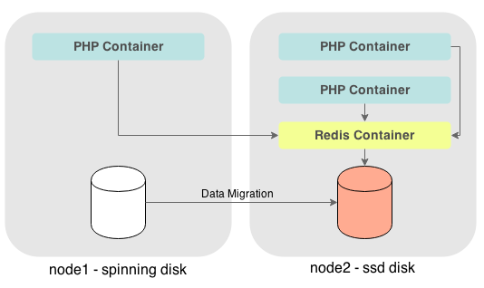
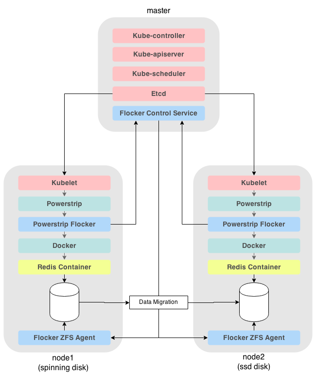

## powerstrip-k8s-demo

A demo of [powerstrip-flocker](https://github.com/clusterhq/powerstrip-flocker) and [kubernetes](https://github.com/googlecloudplatform/kubernetes) migrating a database with it's data.  The data migration is powered by [flocker](https://github.com/clusterhq/flocker) and the networking is powered by [weave](https://github.com/zettio/weave) 


## install

First you need to install:

 * [virtualbox](https://www.virtualbox.org/wiki/Downloads)
 * [vagrant](http://www.vagrantup.com/downloads.html)

## start vms

To run the demo:

```bash
$ git clone https://github.com/binocarlos/powerstrip-k8s-demo
$ cd powerstrip-k8s-demo
$ vagrant up
```

## scenario

This demo is the classic kubernetes `guestbook` app that uses PHP and Redis.

The aim is to migrate the Redis container AND it's data using nothing other than Kubernetes primitives.

We have labeled the 2 minions `spinning` and `ssd` to represent the types of disk they have.  The Redis server is first allocated onto the node with the spinning disk and then migrated (along with its data) onto the node with an ssd drive.

This represents a real world migration where we realise that our database server needs a faster disk.

#### before migration


#### after migration


## demo

We have 1 `pod` for the Redis server and a `replication controller` for the PHP containers.

The first step is to SSH into the master node.

```bash
$ vagrant ssh master
```

We can now use the `kubectl` command to analyze our Kubernetes cluster:

```bash
master$ kubectl get nodes
NAME                LABELS              STATUS
democluster-node1   disktype=spinning   Ready
democluster-node2   disktype=ssd        Ready
```

Notice how we have labelled node1 with `disktype=spinning` and node2 with `disktype=ssd`.  We will use these labels together with a `nodeSelector` for the Redis Master pod.  The `nodeSelector` is what decides which node the redis container is scheduled onto.

We can also use `kubectl` to list the pods on the cluster:

```bash
master$ kubectl get pods
POD                 IP                  CONTAINER(S)        IMAGE(S)            HOST                LABELS              STATUS              CREATED
```

### start services
The first step is to spin up the 2 services.  Services are Kubernetes way of dynamically routing around the cluster - you can read more about services [here](https://github.com/GoogleCloudPlatform/kubernetes/blob/master/docs/services.md).

```bash
master$ kubectl create -f /vagrant/examples/guestbook/redis-master-service.json
master$ kubectl create -f /vagrant/examples/guestbook/frontend-service.json
```

We can check that those services were registered:

```bash
master$ kubectl get services
```

### start redis master
The next step is to start the redis master pod - we use the `redis-master-pod-spinning.json` file which has a nodeSelector set to `disktype=spinning`.

```bash
master$ kubectl create -f /vagrant/examples/guestbook/redis-master-controller.json
```

Once we have done this we run `kubectl get pods` and wait for the redis-master to move from status `Pending` to status `Running`

### start PHP replication controller
Now we start the PHP replication controller - this will start 3 PHP containers which all link to the redis-master service:

```bash
master$ kubectl create -f /vagrant/examples/guestbook/frontend-controller.json
```

Again - once we have run this - we run `kubectl get pods` and wait for our PHP pods to be in the `Running` state.

### confirm location of redis-master

Notice how the redis-master has been allocated onto node1 (`democluster-node1`):

```bash
master$ kubectl get pods | grep name=redis-master
redis-master-pod            10.2.2.8            redis-master        dockerfile/redis                          democluster-node1/172.16.255.251   app=redis,name=redis-master                    Running             About an hour
```

### access application

The next step is to load the app in your browser using the following address:

```
http://172.16.255.251:8000
```

This will load the guestbook application - make a couple of entries clicking `Submit` after each entry.


### migrate database
Now it's time to tell kubernetes to move the Redis container and its data to node2 (the one with an SSD drive).

The first step is to stop the redis-master pod:

```bash
master$ kubectl delete pod redis-master-pod
```

Then we re-schedule the redis-master pod using the config file with the `disktype=ssd` nodeSelector.

```bash
master$ kubectl create -f /vagrant/examples/guestbook/redis-master-pod-ssd.json
```

Once we have done this we run `kubectl get pods` and wait for the redis-master to move from status `Pending` to status `Running`.

Notice how the redis-master has been allocated onto node2 (`democluster-node2`):

```bash
master$ kubectl get pods | grep name=redis-master
redis-master-pod            10.2.3.9            redis-master        dockerfile/redis                          democluster-node2/172.16.255.252   app=redis,name=redis-master                    Running             About an hour
```

### access application

Now, load the app in your browser using same address:

```
http://172.16.255.251:8000
```

It should have loaded the entries you made originally - this means that Flocker has migrated the data onto another server!

## how it works

The key part of this demonstration is the usage of [Flocker](https://github.com/clusterhq/flocker) to migrate data from one server to another.  Also, that we triggered the migration using standard orchestration tools which are speaking to [Powerstrip](https://github.com/clusterhq/powerstrip) and [powerstrip-flocker](https://github.com/clusterhq/powerstrip-flocker).

### powerstrip setup
We have installed [Powerstrip](https://github.com/clusterhq/powerstrip) and [powerstrip-flocker](https://github.com/clusterhq/powerstrip-flocker) on each host.  This means that when Kubernetes starts a container with volumes - [powerstrip-flocker](https://github.com/clusterhq/powerstrip-flocker) is able prepare / migrate the required data volumes before hand.

### Kubernetes Cluster
The 2 nodes are joined by the Kubernetes `master`.  This runs the various other parts of Kubernetes (`kube-controller`, `kube-scheduler`, `kube-apiserver`, `etc`).  It also runs the `flocker-control-service`.



## Restart cluster

If you `vagrant halt` the cluster - you will need to restart the cluster using this command:

```bash
$ make boot
```

This will `vagrant up` and then run `sudo bash /vagrant/install.sh boot` which spins up all the required services.


## /vagrant/demo.sh

There is a script that can automate the steps of the demo:

```bash
$ vagrant ssh master
master$ sudo bash /vagrant/demo.sh up
master$ sudo bash /vagrant/demo.sh switch
master$ sudo bash /vagrant/demo.sh down
```